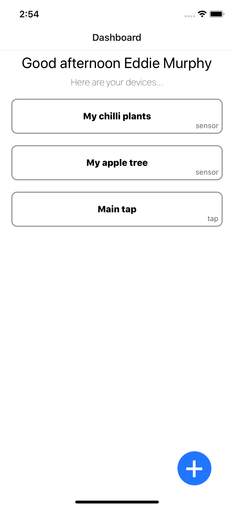
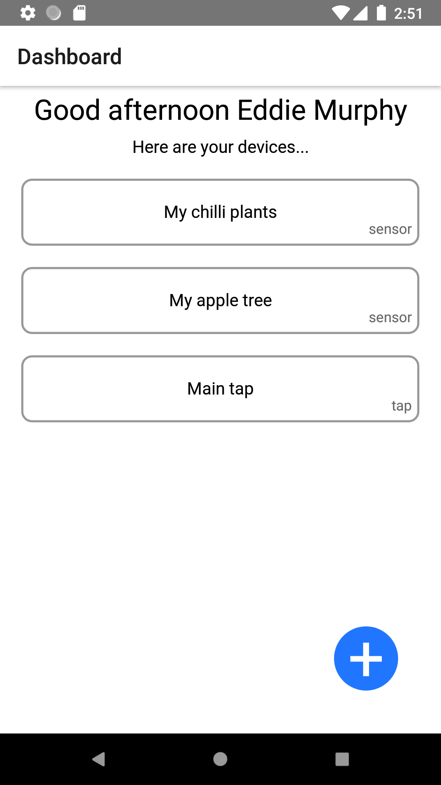
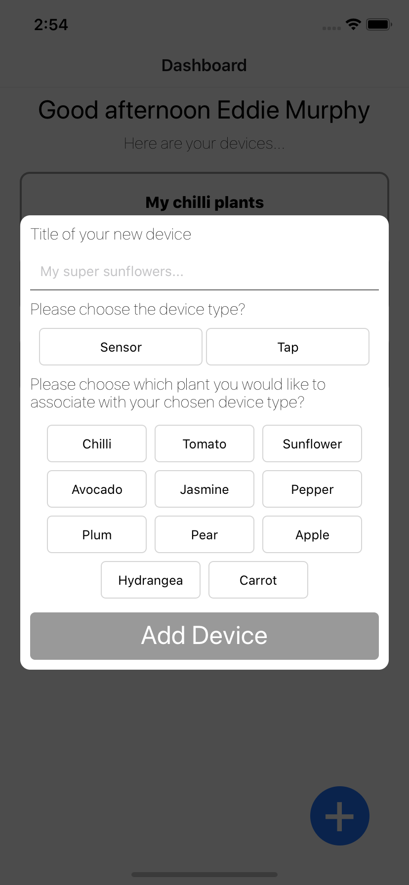
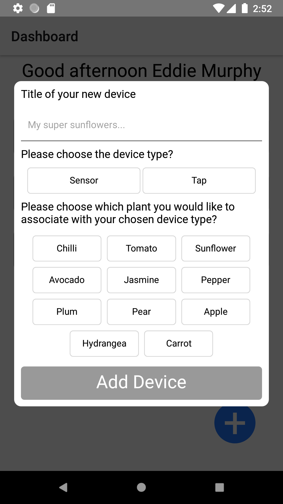
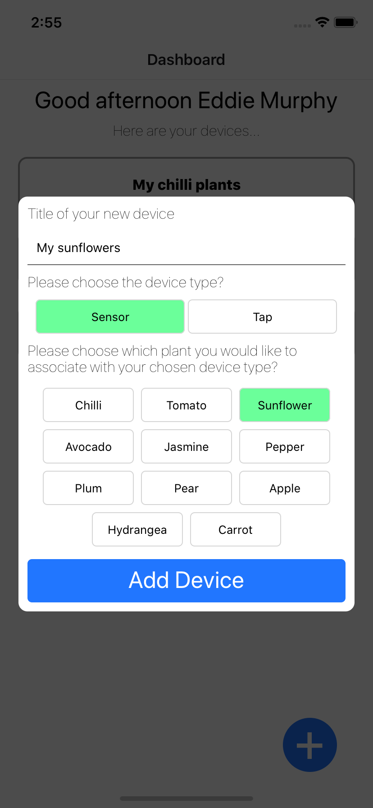
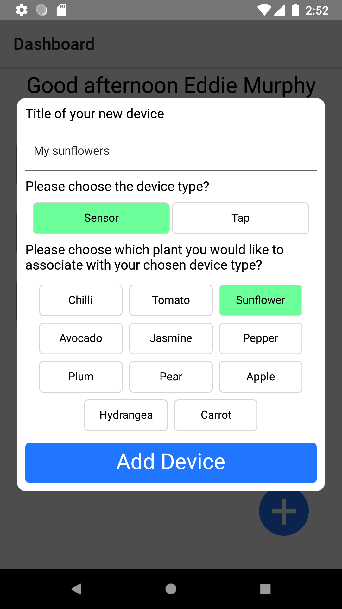

### FEChallenge

Using React Native, being given a set of select requirements, created a quick monitoring app accomplishing Tasks 1,2,3,4 within a few hours. Works on both iOS & Android.

### Requirement

This was the [requirement.](requirementFiles/README.md)

### Running it locally
###### I have an assumption that you've run a React Native project before, so no prerequisites will be listed.

You will need a separate terminal running the server locally

```$ yarn serve```

Then to run on iOS

```$ cd ios && pod install``` \
```$ cd ..``` \
```$ yarn ios```

Or to run on Android
###### *** you will need a local.properties file added to your android folder that shows the path to your Android SDK. You might also need an emulator already running too. ***
```$ yarn android```

###### One gotcha might be you need to forward a port using `$ adb reverse tcp:4000 tcp:4000` if your devices don't show up.

### Screenshots
#### Dashboard

|                                  iOS | Android                                  |
| -----------------------------------: | :--------------------------------------- |
|  |  |

#### Opened Modal

|                                  iOS | Android                                  |
| -----------------------------------: | :--------------------------------------- |
|  |  |

#### Add a device

|                                  iOS | Android                                  |
| -----------------------------------: | :--------------------------------------- |
|  |  |

### Gifs

|                                      iOS | Android                                           |
| ---------------------------------------: | :------------------------------------------------ |
|  | .gif) |

### Improvements

- Would have like to have discussed with a designer/creative about some sort of UI / UX - It's currently very dull but functional.
- The adding a device flow could be something like;
  - Press add new device
  - Instructions to press the pairing button on the physical device pops up and awaits pairing.
  - Device found, it knows if it’s a sensor or tap and asks you to name it and asks you to associate the plants that go with said sensor or tap.
  - Done
- Once it's at more of a stable state, start adding some snapshot test's potentially. Adding detox for some critical E2E flows would be most beneficial too. At this point in time, I don't see the benefits of any tests, especially as we are meant to be rapidly prototyping. Things will be thrown in the bin constantly.
- I would like the BE to report water levels/humitidy % etc. The more data the better... Would be great to tap into each sensor/tap/plant and get a real influx of data on each.